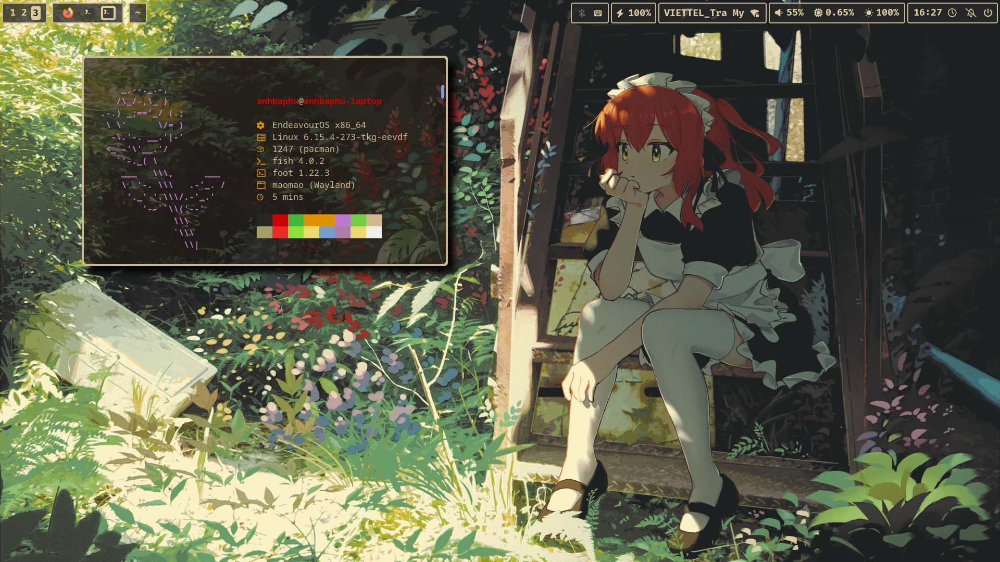

<div align="center">
    <h1>crystal-dots</h1>
</div>

# Picture


# Installations (for Arch or Arch based distro linux!)


```
cd ~ && git clone https://github.com/crystalforceix/crystal-dots && cd ~/crystal-dots/multi-scripts/testing-scripts/ && ./install.fish
```

- You can unlinking config folder from crystal-dots like this

'''
cd ~/crystal-dots/multi-scripts/testing-scripts/ && ./unlink-config.fish
'''

